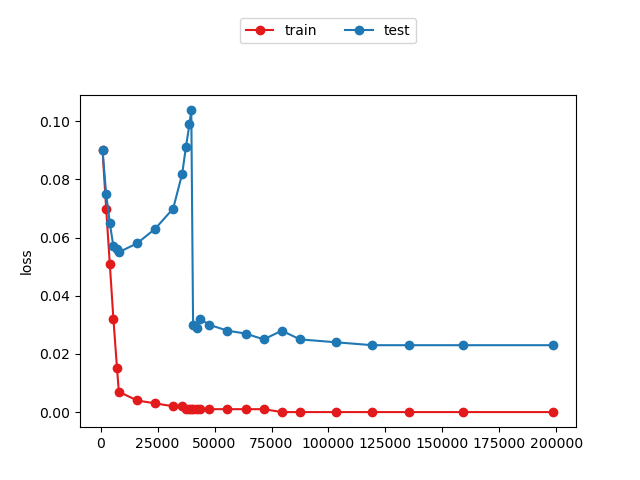
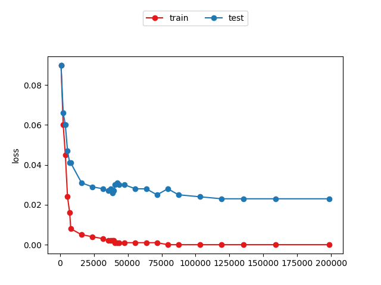
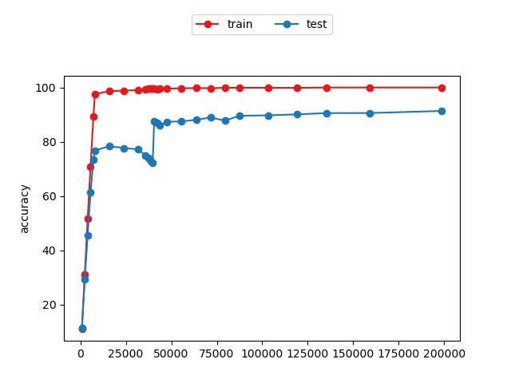
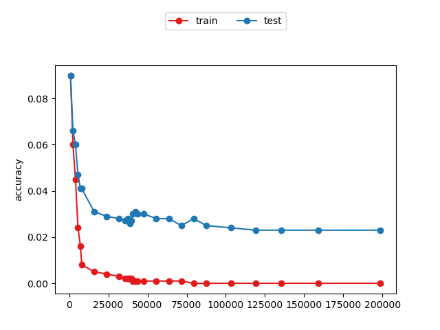

# double-descent-pytorch
Implementation / replication of double descent curve with PyTorch on MNIST in <a href="https://www.pnas.org/content/116/32/15849.short">this paper</a> and specifically its <a href="https://arxiv.org/abs/1812.11118">ArXiv version</a>.

To reproduce figure.9 (a) and (c), run the following command. Control whether to use weight reuse with flag `--reuse`. It took around 15 hours to create a single figure on one 1080ti gpu.

```
python mnist_double_descent.py --reuse --verbose 1
```
With weight reuse             |  Without weight reuse
:-------------------------:|:-------------------------:
  |  
  |  
